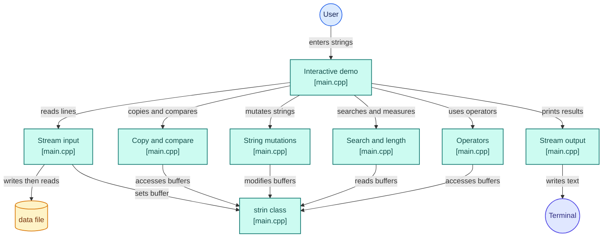

<div align="center">

# 🔤 strin: Custom String Class in C++

**A hand-built string class with operator overloading and a from-scratch reimplementation of the `<cstring>` library.**


</div>

---

## 📖 About

`strin` is a C++ class that wraps a raw `char*` buffer and rebuilds the behaviour of the standard C string functions on top of it. The goal is to understand what happens *under the hood* of `std::string` and `<cstring>`: manual memory management, constructors, operator overloading, and friend functions.

The included `main()` is an interactive demo that reads two strings from the user and runs every function on them, with color-coded section headings in the terminal.

---

## ✨ Features

### 🏗️ Constructors

| Constructor | Purpose |
|---|---|
| `strin()` | Default: allocates an empty 40-character buffer |
| `strin(const char*)` | Builds a `strin` from a C-string |
| `strin(const strin&)` | Copy constructor: deep copy of the buffer |

### ⚙️ Overloaded operators

| Operator | Description |
|---|---|
| `+` | Concatenate two strings |
| `=` | Assign one string to another |
| `[]` | Index into the string (returns `char&`, so it is readable and writable) |
| `>` `<` `>=` `<=` `==` `!=` | Lexicographic comparison |
| `>>` | Read a full line from an input stream (spaces included) |
| `<<` | Print to an output stream |

### 🧰 String functions (friend functions on `strin`)

| Function | What it does |
|---|---|
| `strcpy(dst, src)` | Copy a whole string |
| `strncpy(dst, src, n)` | Copy the first `n` characters |
| `strcmp(a, b)` | Compare two strings |
| `strncmp(a, b, n)` | Compare the first `n` characters |
| `strcat(a, b)` | Append `b` to `a` |
| `strncat(a, b, n)` | Append the first `n` characters of `b` to `a` |
| `strrev(s)` | Reverse in place |
| `strupper(s)` / `strlower(s)` | Convert case in place |
| `strchr(s, c)` | Find the first occurrence of a character |
| `strrchr(s, c)` | Find the last occurrence of a character |
| `strstr(s, sub)` | Find a substring |
| `strlen(s)` | Length of the string |

---

## 🏗️ Architecture

The interactive demo in `main.cpp` takes the user's strings, hands them to the `strin` class, and calls each group of functions on them. Input goes through a small temporary data file, and all results are printed to the terminal.



| Color | Meaning |
|---|---|
| 🟦 Blue | The user |
| 🟩 Teal | Code in `main.cpp`: the demo, the function groups and the `strin` class |
| 🟨 Amber | The temporary `data` file used by `operator>>` |
| 🟪 Indigo | The terminal output |

---

## 🧠 Concepts Demonstrated

- Classes, constructors, and the **rule of three** (copy constructor, assignment, destructor)
- **Operator overloading** as member and friend functions
- **Friend functions** and function overloading alongside `<cstring>`
- Dynamic memory with raw pointers
- Stream I/O overloading (`istream` / `ostream`) and file streams
- Pointer arithmetic and character manipulation (ASCII case conversion)

---

## 🚀 Getting Started

### Prerequisites

- A C++ compiler such as `g++` or `clang++`
- A terminal with ANSI color support (Linux, macOS, Windows Terminal)

### Build and run

```bash
git clone https://github.com/syampullamar/<your-repo-name>.git
cd <your-repo-name>
g++ -Wall -o strin main.cpp
./strin
```

---

## 🧪 Demo

The program asks for two strings, then runs each function in turn.

```
Enter s1 ans s2
hello
world
s1:  hello  s2:   world

strcpy
s1:  hello  s2:  world
Result:
world

strncpy
s1:  hello  s2:  world
Result:
wor

strcmp
s1:  hello  s2:  world
Result:
Not Equal
...
```

Each section prints the inputs, then the result of one function, so you can compare behaviour with the standard library.

---

## 📁 Project Structure

```
.
├── main.cpp    # strin class, friend functions and demo driver
└── README.md
```

---

## 🛠️ Known Issues and Roadmap

This is a learning project, and there are a few things I plan to improve:

- [ ] Use `new char[n]` (array form) in the `const char*` constructor
- [ ] Add a destructor that calls `delete[]` to free memory
- [ ] Make `operator=` a deep copy and return `strin&`
- [ ] Reallocate the buffer in `strcat`, `strncat`, `strcpy` and `strncpy` instead of assuming enough space
- [ ] Fix the match condition in `strstr`
- [ ] Read input directly into a buffer instead of through a temporary file
- [ ] Handle end-of-file in `operator>>`
- [ ] Take arguments by `const strin&` to avoid needless copies
- [ ] Split into `strin.h` / `strin.cpp` and add a Makefile
- [ ] Add unit tests

---

## 🤝 Contributing

Suggestions and pull requests are welcome.

1. Fork the repo
2. Create a branch: `git checkout -b feature/my-feature`
3. Commit and push your changes
4. Open a Pull Request

---

<div align="center">

**Built by [Syam Prasad Pullamar](https://github.com/syampullamar)**

If this helped you understand how strings work under the hood, consider giving it a ⭐

</div>
